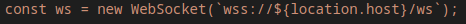

# RequestloggerApp
- Simple ASP.NET core app which logs GET, PUT and POST requests to the **/test** endpoint.

- Requests are displayed in base root path **/**:

- Every time the page is refreshed, the logs are cleaned.

## Running locally
To run the app without Docker, simply run **dotnet run** command.

- App uses web sockets to display loggged requests (SignalR library). 

It is designed to run alongside with SSL certificate - therefore if you want to **debug/test the app locally**, you need to change the following line in **Program.cs** and replace **wss:// with ws://**:

### With SSL cert:

### Without SSL cert:

## Testing
To test the app, use either curl, postman or your preffered client to initiate HTTP/HTTPS requests.

As mentioned earlier, app logs requests sent to the **/test** endpoint and displays them in **base root path**.

### Example with curl

